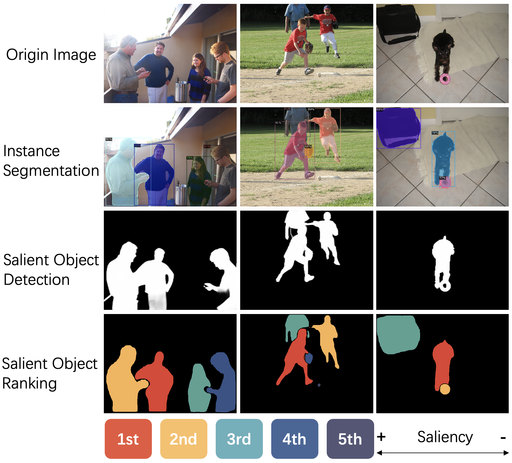
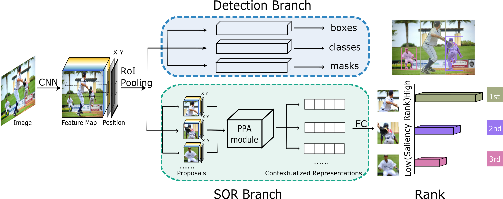
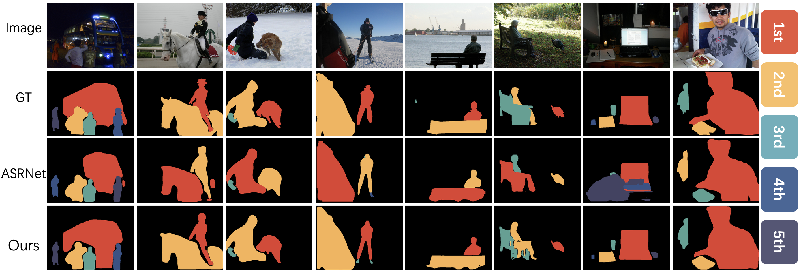

# SOR

Implementation of "Salient Object Ranking with Position-Preserved Attention"

<div align=left></div>

> [**Salient Object Ranking with Position-Preserved Attention**](https://arxiv.org/abs/2106.05047)            
> Hao Fang, Daoxin Zhang, Yi Zhang, Minghao Chen, Jiawei Li, Yao Hu, Deng Cai, Xiaofei He           
>  *Arxiv Preprint 2106*

## Abstract
Instance segmentation can detect where the objects are in an image, but  hard to understand the relationship between them. We pay attention to a  typical relationship, relative saliency. A closely related task, salient object detection, predicts a binary map highlighting a visually salient region while hard to distinguish multiple objects. Directly combining  two tasks by post-processing also leads to poor performance. There is a  lack of research on relative saliency at present, limiting the practical applications such as content-aware image cropping, video summary, and  image labeling. In this paper, we study the Salient Object Ranking (SOR) task, which manages to assign a ranking order of each detected object  according to its visual saliency. We propose the first end-to-end  framework of the SOR task and solve it in a multi-task learning fashion. The framework handles instance segmentation and salient object ranking  simultaneously. In this framework, the SOR branch is independent and  flexible to cooperate with different detection methods, so that easy to  use as a plugin. We also introduce a Position-Preserved Attention (PPA)  module tailored for the SOR branch. It consists of the position  embedding stage and feature interaction stage. Considering the  importance of position in saliency comparison, we preserve absolute  coordinates of objects in ROI pooling operation and then fuse positional information with semantic features in the first stage. In the feature  interaction stage, we apply the attention mechanism to obtain proposals' contextualized representations to predict their relative ranking  orders. Extensive experiments have been conducted on the ASR dataset.  Without bells and whistles, our proposed method outperforms the former  state-of-the-art method significantly. The code will be released  publicly available on https://github.com/EricFH/SOR.    


## Framework



## Detail

1. Clone the repository

```bash
git clone git@github.com:EricFH/SOR.git
```

2. Install dependencies

This project is based on [centermask2](https://github.com/youngwanLEE/centermask2). There are many pretrained models can be used in this project as backbone of network.

The main dependency is [detectron2](https://github.com/facebookresearch/detectron2), a concise detection framework. Please follow the [installation tutorial](https://detectron2.readthedocs.io/en/latest/tutorials/install.html).

3. Data preparation

Download ASSR dataset from [goole drive](https://drive.google.com/file/d/1ueSpf3avLAPiJxoP40v5KL7qxaYtM1us/view?usp=sharing) and extract it, then link or move ASSR to `sor_ppa/datasets/ASSR`

4. Training

```bash
python train_sor.py --config-file configs/sor/ppa.yaml --num-gpus 2
```

5. Testing

```bash
python train_sor.py --config-file configs/sor/ppa.yaml --eval-only MODEL.WEIGHTS path/to/model
```

There is a pretrained model (centermask-39) release on [google drive](https://drive.google.com/file/d/10oqR9YsDrwicpbykL91bu0HYBndvl6PQ/view?usp=sharing)

## Demo 



## Talk

[Youtube](https://www.youtube.com/watch?v=cVrUxbWmkmc)

## Citation

```bash
@InProceedings{Fang_2021_ICCV,
    author    = {Fang, Hao and Zhang, Daoxin and Zhang, Yi and Chen, Minghao and Li, Jiawei and Hu, Yao and Cai, Deng and He, Xiaofei},
    title     = {Salient Object Ranking With Position-Preserved Attention},
    booktitle = {Proceedings of the IEEE/CVF International Conference on Computer Vision (ICCV)},
    month     = {October},
    year      = {2021},
    pages     = {16331-16341}
}
```

